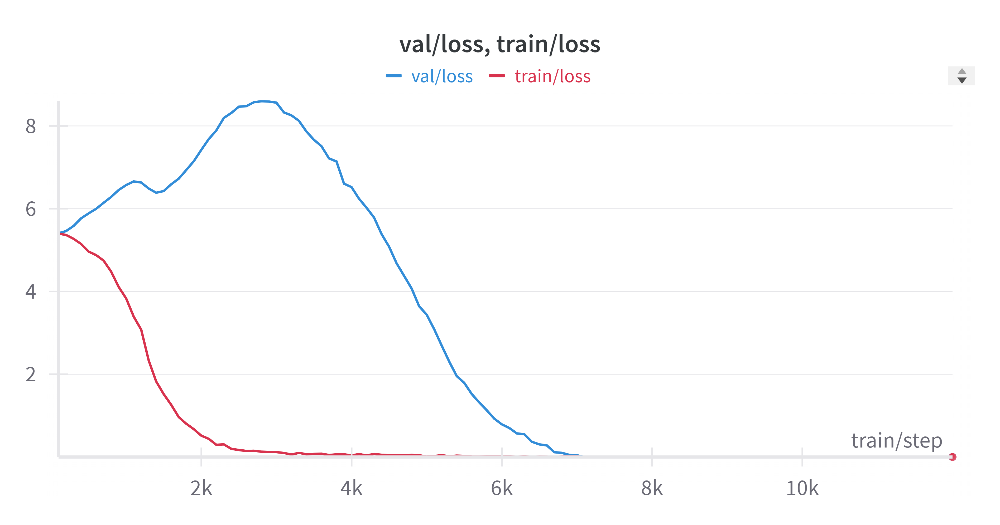

# Training Model for Grokking

You can reproduce [Grokking](https://arxiv.org/abs/2201.02177) phenomenon in just 10 minutes of training on a single RTX 3080.

We train a tiny transformer that can learn to compute a simple math expression reaching train and eventually val loss of ~0. Synthetic dataset is generated and tokenized on-the-fly .

To run the baseline grokking experiment, simply run:

```python
python train.py configs/grokking/prime223.yaml
```

You should see training loss of `0` (memorization) fairly soon and eventually validation of loss of `0` (generalization) like this:


Stats:

```text
Model params (all): 457,578
Model params (non emb): 426,986
Train tokens: 30,309,625
Train samples: 24,753
Global batch size: 512
Train steps: 12,000
Context length: 5
Train loss: 0.00000010128132288401
Val loss: 0.00000022627273210674
Run time: 0.14156427994833293 hr (1x NVIDIA RTX 4500 Ada Generation)
```

[Detailed Logs](results/grokking/prime223/log.txt)

There are also [few other configs](/configs/grokking) you can try.


