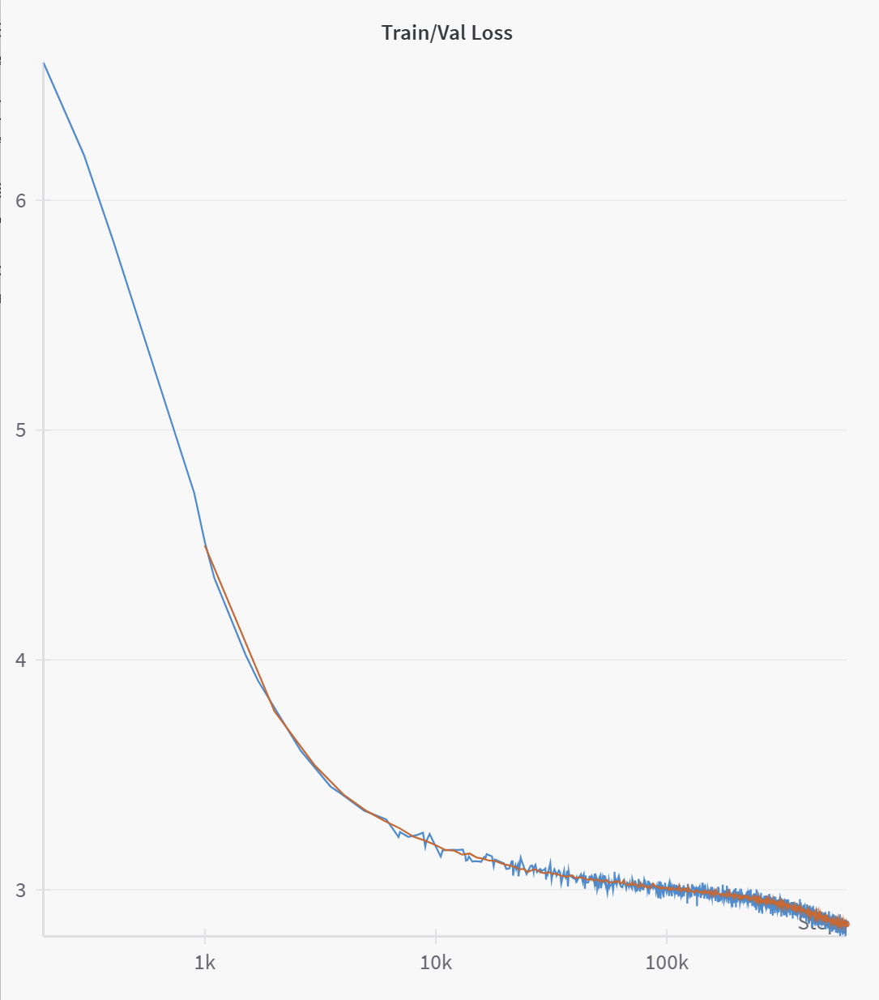

# Training on OpenWebText

You can train on OpenWebText dataset like this:

```bash
# download dataset
python scripts/datasets/openwebtext/download.py

# tokenize input file using byte tokenizer
python tokenize_dataset.py configs/tokenize/openwebtext_tiktoken_gpt2.yaml

# training using GPT2 124M model on single GPU
# with Karpathy's original NanoGPT configuration
python train.py configs/train_gpt2/openwebtext_classic.yaml

# training using GPT2 124M model with 10B tokens of OpenWebText dataset
# with Keller Jorden's model+WSD schedule+AdamW+3X LR configuration
# on slurm infra
bash volcano_karpathy_owt10b.sh

# training using GPT2 124M model with 10B tokens of OpenWebText dataset
# with Karpathy's llm.c configuration
# on slurm infra
bash slurm_owt10b_baseline.sh

# generate completitions for the prompt
python generate.py configs/train_gpt2/openwebtext_classic.yaml
```



Stats:

```text
Model params (all): 124,337,664
Model params (non emb): 84,953,856
Dataset train tokens: 9,035,525,879
Dataset val tokens: 4,489,170
Dataset train samples: 752,960,490
Dataset val samples: 140,287
Vocab Size: 50,257
Trained on total tokens: 294,912,000,000
Global batch size: 480
Train steps: 600,000
Context length: 1024
Train loss: 2.7935577392578126
Val loss: 2.83925675034523
Train Time (hr): 61.71 hr (8x NVIDIA H100 80GB HBM3)
```

## Reproducibility

Karpathy's original GPT2-124M run does 600,000 steps on a global batch of 480 with context length of 1024. So, that's 294B tokens in training, about 32.8 epochs. This would should take 1.24 days per training calculator (237.68 hours) on 8xH100/BF16 (~4 days on A100). Run uses default settings by Karpathy (LR of 6E-4 and warmup of 2000 etc). Val loss is 2.85 (OpenAI GPT2 val loss is 3.11 due to distribution differences, train loss 3.12).

## 10B Token Run

For quick experiment, try 10B tokens instead of 295B tokens.

```bash
python train.py configs/train_gpt2/openwebtext_tokens10b_classic.yaml
```

Baseline based on Karpathy's config (before v0.3.8):

```text
Trained on total tokens: 9,999,974,400
Train steps: 20,344
Train loss: 3.0855010986328124
Val loss: 3.0888511716884417
Train Time (hr): 1.56 hr (8x NVIDIA H100 80GB HBM3)
```

After removing barrier, single reduce (v0.3.8):

```text
Trained on total tokens: 9,999,974,400
Train steps: 20,345
Train loss: 3.071729532877604
Val loss: 3.0704586088222308
Train Time (hr): 1.22 (8x NVIDIA H100 80GB HBM3)
```

Observation: Barrier weren't required and it + another reduce cost 0.34hr.

With ZeroOptimizer (v0.3.9):

```text
Trained on total tokens: 9,998,008,320
Train steps: 20,340
Train loss: 3.065877787272135
Val loss: 3.0901788899498266
Train Time (hr): 1.22 (8x NVIDIA H100 80GB HBM3)
```

Observation: Val loss went high but probably still within acceptable range. Time remained same.

Karpathy's llm.c config:

```text
Trained on total tokens: 10,666,639,360
Train steps: 20,345
Train loss: 3.0496087074279785
Val loss: 3.02673102643368
Train Time (hr): 1.25 (8x NVIDIA H100 80GB HBM3)
```

Observation: Lower val loss for 6.7% more tokens for equivalently same time.

Keller Jordan AdamW config:

```text
Trained on total tokens: 10,666,639,360
Train steps: 20,345
Train loss: 3.011476516723633
Val loss: 3.0123847484588624
Train Time (hr): 1.27 (8x NVIDIA H100 80GB HBM3)
```

Similar loss as llm.c.

Karpathy's llm.c config with distributed val:

```text
Trained on total tokens: 10,666,639,360
Train steps: 20,345
Train loss: 3.0496087074279785
Val loss: 3.02673102643368
Train Time (hr): 1.24 (8x NVIDIA H100 80GB HBM3)
Run Time (hr): 1.327496601332807
```

Keller AdamW config with distributed val:

```text
Trained on total tokens: 10,666,639,360
Train steps: 20,345
Train loss: 3.0096380710601807
Val loss: 2.9958531061808267
Train Time (hr): 1.264700971551041 (8x NVIDIA H100 80GB HBM3)
Run Time (hr): 1.2935799625552156
```

Keller AdamW config but with val config from Karpathy:

```text
Trained on total tokens: 10,666,639,360
Train steps: 20,345
Train loss: 3.0154712200164795
Val loss: 3.00369873046875
Train Time (hr): 1.2612408693383144 (8x NVIDIA H100 80GB HBM3)
Run Time (hr): 1.3436820502713736
```

Karpathy's llm.c config but with Keller AdamW val config:

```text
Trained on total tokens: 10,666,639,360
Train steps: 20,345
Train loss: 3.0582926273345947
Val loss: 3.051426887512207
Train Time (hr): 1.246192487568807 (8x NVIDIA H100 80GB HBM3)
Run Time (hr): 1.280788689654631
```

Observation: Karpathy's val takes 0.04hr more but seems more better.

Karpathy original but closer to 10B with zero optim:

```text
Trained on total tokens: 10,666,475,520
Train steps: 21,701
Train loss: 3.087213897705078
Val loss: 3.054884948730469
Train Time (hr): 1.313675880413501 (8x NVIDIA H100 80GB HBM3)
Run Time (hr): 1.3700039549658285
```

Karpathy original but closer to 10B without zero optim:

```text
Trained on total tokens: 10,666,475,520
Train steps: 21,701
Train loss: 3.175733693440755
Val loss: 3.1655511474609375
Train Time (hr): 1.3071260947987708 (8x NVIDIA H100 80GB HBM3)
Run Time (hr): 1.3543935026833789
```