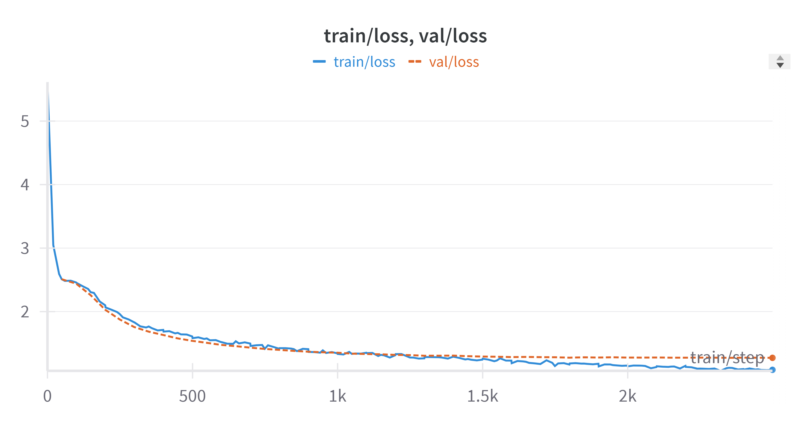

# Training on Tinyshakespeare

You can train on Tinystories V2 dataset like this:

```bash
# download raw dataset
mkdir -p $DATA_ROOT/datasets/tinyshakespeare
wget -P $DATA_ROOT/datasets/tinyshakespeare https://raw.githubusercontent.com/karpathy/char-rnn/master/data/tinyshakespeare/input.txt

# tokenize input file using byte tokenizer
python tokenize_dataset.py configs/tokenize/tinyshakespeare_byte.yaml

# run training using GPT2 124M model
python train.py configs/train_gpt2/tinyshakespeare.yaml

# generate completitions for the prompt
python generate.py configs/train_gpt2/tinyshakespeare.yaml
```


Stats:

```text
Model params (all): 10,819,968
Model params (non emb): 10,621,824
Dataset train tokens: 998,021
Dataset val tokens: 110,153
Dataset train samples: 6499
Dataset val samples: 723
Vocab Size: 260
Trained on total tokens: 40,960,000
Global batch size: 64
Train steps: 2500
Context length: 256
Train loss: 1.0831478834152222
Val loss: 1.2721147787570954
Run time: 0.016054142607241 hr (1x NVIDIA A100 80GB PCIe)
```

[Detailed Logs](results/grokking/tinyshakespeare/log.txt)